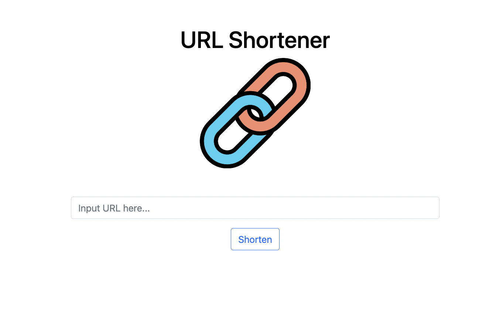
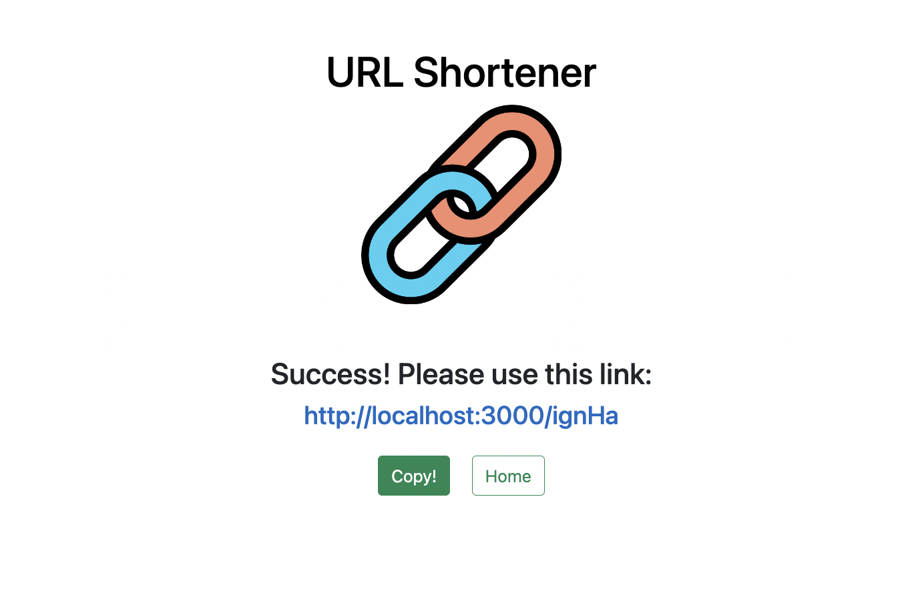

# 短網址產生器



## 產品功能
* 供使用者簡化網址
* 於網址列輸入既有短網址可自動導向原始網頁

## 開始使用
1. 確認本地已安裝Node.js與npm
2. 打開terminal，輸入以下指令Clone本專案至本地
  ```
  git clone https://github.com/Nilney/url_shortener.git
  ```
3. 進入此專案資料夾，輸入以下指令以安裝 npm 套件
  ```
  npm install
  ```
4. 準備您的MongoDB database，自行新增.env檔，含以下內容
  ```
  MONGODB_URI="你的URI字串"
  ```
5. 輸入以下指令以啟動本專案
  ```
  npm run start
  ```
6. 顯示以下資訊代表本專案順利運行，輸入網址至瀏覽器便可瀏覽此專案網頁
  ```
  App is running on http://localhost:3000
  ```
7. 若要停止使用，請輸入以下指令
  ```
  ctrl + c
  ```
## 開發工具
* Node.js @14.16.0
* npm @6.14.11
* nodemon @2.0.22
* express @4.17.1
* express-handlebars @3.0.0
* bootstrap 5.1.1
* mongoose @5.9.16
* dotenv @16.3.1